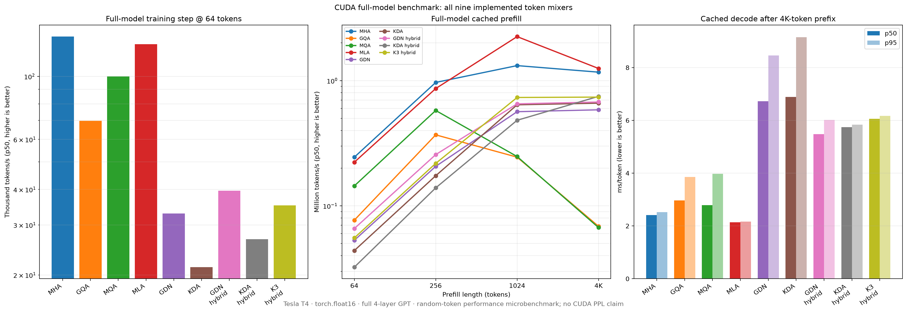
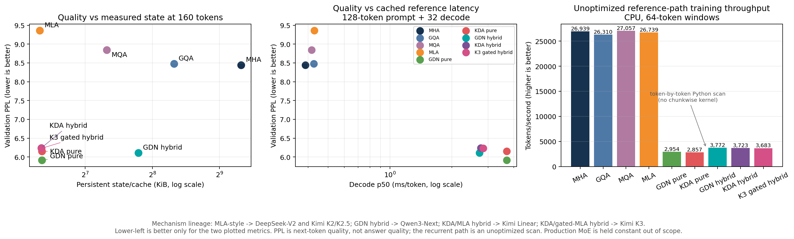
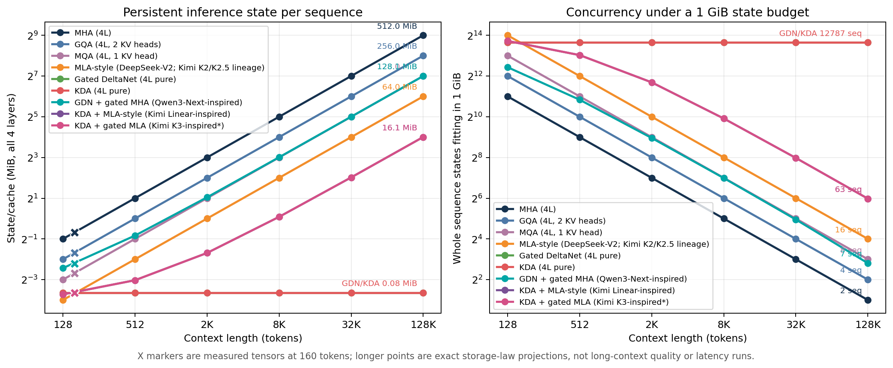
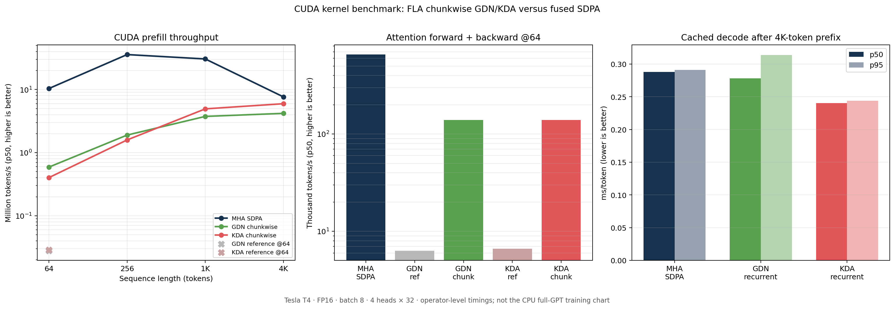

# Transformer Attention Lab

A controlled PyTorch study of the quality, training, prefill, decode, and
memory trade-offs among modern Transformer token mixers.

The repository implements and compares nine 4-layer decoder systems:

- multi-head attention (MHA);
- grouped-query attention (GQA);
- multi-query attention (MQA);
- MLA-style latent attention;
- Gated DeltaNet (GDN);
- Kimi Delta Attention (KDA);
- `3 × GDN + 1 × gated MHA`;
- `3 × KDA + 1 × MLA-style`;
- `3 × KDA + 1 × gated MLA-style`.

The main research lesson is deliberately not a single-winner claim:

> Recurrent linear attention provides a real state-memory advantage, but its
> realized speed depends on the execution kernel and the surrounding model.
> Optimized kernels make the comparison fair; they do not make one
> architecture universally best.



## Research question

Can recurrent and compressed attention mechanisms reduce persistent inference
memory without an unacceptable loss in quality or end-to-end performance?

The project evaluates that question through three separate evidence sets:

| Evidence set | Purpose | What it can support |
|---|---|---|
| CPU full-model training | Quality, cache/state layout, and readable reference equations | Validation perplexity and memory trade-offs |
| CUDA operator benchmark | Isolate reference-scan versus optimized-kernel effects | Kernel-level prefill, backward, and decode performance |
| CUDA full-model benchmark | Compare all nine systems inside one decoder | End-to-end training-step, prefill, decode, and cache results |

Absolute timings from these three scopes are not mixed. The CUDA timing runs
use random inputs and do not produce new quality evidence.

## Main findings

### 1. The first CPU result exposed an implementation confounder

In the controlled one-epoch CPU experiment, GDN and KDA used an exact
token-by-token PyTorch recurrence, while MHA used optimized attention
primitives. The resulting training rates were:

- MHA: **26,939 tok/s**;
- GDN: **2,954 tok/s**;
- KDA: **2,857 tok/s**.

This approximately 9× gap measures different execution paths, not an intrinsic
9× architectural disadvantage. It motivated the separate CUDA kernel and
full-model experiments.

### 2. Recurrent attention retained a strong memory result

The CPU training experiment used the same Shakespeare split, character
tokenizer, seed, optimizer, four-layer backbone, 64-token training window, and
one complete pass over **1,003,840 training tokens** for every variant.

Selected results:

| Variant | Validation PPL ↓ | Persistent state at 160 tokens ↓ |
|---|---:|---:|
| MHA | 8.44 | 640.0 KiB |
| MLA-style | 9.36 | 80.0 KiB |
| GDN | **5.91** | 82.0 KiB |
| KDA | 6.15 | 82.0 KiB |
| KDA + MLA-style | 6.24 | **81.5 KiB** |

These character-level perplexities are comparable only inside this controlled
run. They are not evidence that the same ranking will hold for a large
tokenized LLM.



The implemented storage laws show the architectural distinction:

- MHA/GQA/MQA/MLA caches grow linearly with context length;
- pure GDN/KDA retain a fixed recurrent state;
- the 3:1 hybrids combine a fixed recurrent component with one token-growing
  attention cache.

At a projected 128K context, the KDA/MLA hybrid uses **16.06 MiB** versus
**64.00 MiB** for four MLA-style layers. This is an exact cache-layout
projection, not a 128K quality or latency measurement.



### 3. CUDA kernels removed much of the reference-scan penalty

On a Tesla T4 operator-only benchmark, FLA chunkwise execution was:

- **21.1×** faster than the GDN reference path at 64-token prefill;
- **13.9×** faster than the KDA reference path at 64-token prefill;
- **21.9× / 21.1×** faster for GDN/KDA forward + backward.

At 4K operator prefill, MHA reached 7.64M tok/s, KDA 5.96M tok/s, and GDN
4.19M tok/s. KDA had the lowest operator-only cached decode p50 after a 4K
prefix: 0.240 ms/token versus 0.288 for MHA.



These are token-mixer measurements, not full-decoder timings. The full-model
experiment below tests whether the operator result survives the surrounding
projections, normalization, MLP, cache updates, loss, backward pass, and
optimizer step.

### 4. The full CUDA decoder produced a more nuanced result

Environment: **Tesla T4**, compute capability 7.5, PyTorch 2.11.0+cu128,
Flash Linear Attention 0.5.1, FP16. The benchmark uses a four-layer decoder
with width 128 and four heads. Training uses batch 16 × 64 tokens; inference
uses batch 8, prefill lengths up to 4096, and 128 cached decode steps.

| Variant | Full train step tok/s ↑ | 4K prefill tok/s ↑ | Decode p50 ms/token ↓ | Cache after decode ↓ |
|---|---:|---:|---:|---:|
| MHA | **138,007** | 1,168,479 | 2.410 | 66.00 MiB |
| GQA | 69,797 | 68,626 | 2.964 | 33.00 MiB |
| MQA | 99,940 | 67,074 | 2.789 | 16.50 MiB |
| MLA-style | 129,696 | **1,250,504** | **2.140** | 8.25 MiB |
| GDN | 32,946 | 584,688 | 6.726 | **0.57 MiB** |
| KDA | 21,303 | 660,611 | 6.888 | **0.57 MiB** |
| GDN + gated MHA | 39,585 | 674,952 | 5.476 | 16.93 MiB |
| KDA + MLA-style | 26,724 | 748,462 | 5.739 | 2.49 MiB |
| KDA + gated MLA-style | 35,173 | 738,582 | 6.058 | 2.49 MiB |

The cache column is measured at batch 8 after a 4096-token prompt and 128
decode steps, for 4224 cached tokens in total. At that point, pure GDN/KDA use
approximately **116× less persistent cache memory than MHA**.

The decision-level result is:

- MHA is the fastest training configuration in this setup;
- MLA-style is the fastest 4K prefill and cached decode configuration;
- GDN/KDA provide the strongest persistent-state reduction, but not the best
  full-model latency on this GPU and scale;
- an operator-level speed advantage does not automatically transfer to the
  complete decoder.

Raw evidence and the generated summary are in
[`Skoltech_presentation_evidence/`](Skoltech_presentation_evidence/).

## CUDA correctness gate

The readable recurrent scan remains the correctness reference. Before timing,
the CUDA path is loaded with identical weights and receives identical inputs.
The benchmark compares both full-sequence logits and token-by-token cached
logits.

All five recurrent-containing schedules passed:

- maximum absolute full-logit difference: **0.00128174**;
- maximum absolute cached-logit difference: **0.00122070**.

The small differences are expected from FP16 operation ordering. This gate
checks numerical equivalence; it is not a model-quality measurement.

## Execution paths

GDN and KDA expose three explicit scan backends:

- `reference`: transparent token-by-token PyTorch recurrence;
- `compiled`: best-effort `torch.compile` route with recorded fallback;
- `fla`: CUDA-only Flash Linear Attention kernels.

For the FLA route:

- full-sequence training and prefill use chunkwise GDN/KDA kernels;
- one-token cached decode uses fused recurrent kernels after the state has been
  initialized;
- the first 64 cached tokens use the numerically stable chunkwise route;
- MHA/GQA/MQA/MLA-style layers continue to use PyTorch SDPA.

The optimized route changes execution, not the intended recurrent equations.

## Repository layout

```text
.
├── pyproject.toml                    # package metadata and dependencies
├── Makefile                          # common development/experiment commands
├── CITATION.cff                      # citation metadata
├── 09_Efficient_Transformer_Systems/
│   ├── 01_mha_gqa_mla_comparison.ipynb
│   ├── 02_gated_deltanet_kda_hybrids.ipynb
│   ├── 03_cuda_chunkwise_kernels.ipynb
│   └── 04_cuda_full_model_all_variants.ipynb
├── research/
│   ├── attention.py                  # MHA, GQA, MQA, MLA-style + caches
│   ├── linear_attention.py           # GDN/KDA + recurrent state + FLA route
│   ├── model.py                      # common homogeneous/hybrid GPT decoder
│   ├── experiment.py                 # training and evaluation primitives
│   ├── hybrid_experiment.py          # deterministic nine-variant CPU study
│   ├── cuda_full_model_benchmark.py  # end-to-end CUDA benchmark
│   └── plot_*.py                     # figures and result summaries
├── results/                          # CPU and CUDA operator evidence
├── Skoltech_presentation_evidence/   # final CUDA full-model evidence
└── tests/                            # cache, recurrence, gradient, and model tests
```

The earlier `Stage 1` and `Stage 2` notebooks are retained as an exploration
log for compression, quantization, pruning, distillation, low-rank methods,
and MoE. They are not all completed benchmark results.

## Reproduce the project

### Minimal CPU environment

Python 3.12+ and PyTorch are recommended.

```bash
python -m venv .venv
source .venv/bin/activate
python -m pip install --upgrade pip
python -m pip install -e ".[dev,notebooks]"
```

Run the correctness suite:

```bash
python -m unittest discover -s tests -v
```

The suite covers cache accounting, full-versus-cached logits, arbitrary cached
chunks, recurrent gradients, hybrid layer schedules, and plot validation.

### Rebuild committed figures

```bash
python -m research.plot_experiment \
  results/attention_systems_cpu.json --output-dir results

python -m research.plot_hybrid \
  results/hybrid_linear_attention_cpu.json --output-dir results

python -m research.plot_cuda_chunkwise \
  --input-dir results --output-dir results

python -m research.plot_cuda_full_model \
  --input-dir Skoltech_presentation_evidence \
  --output-dir Skoltech_presentation_evidence
```

### Repeat the CPU nine-variant experiment

Provide a text corpus and run:

```bash
python -m research.hybrid_experiment \
  --data /path/to/input.txt \
  --output results/hybrid_linear_attention_cpu.json \
  --training-mode full_epoch \
  --epochs 1 \
  --eval-interval 200 \
  --eval-batches 12 \
  --batch-size 16 \
  --train-context 64 \
  --num-threads 1 \
  --inference-repeats 7
```

### Repeat the CUDA full-model benchmark

The recommended path is
[`04_cuda_full_model_all_variants.ipynb`](09_Efficient_Transformer_Systems/04_cuda_full_model_all_variants.ipynb)
in a Google Colab GPU runtime. It installs the tested FLA version and records
the complete environment.

For an already configured CUDA environment:

```bash
python -m pip install -e ".[cuda]"

python -m research.cuda_full_model_benchmark \
  --output-dir results \
  --dtype auto

python -m research.plot_cuda_full_model \
  --input-dir results \
  --output-dir results
```

The first run compiles GPU kernels and may take several minutes. The benchmark
refuses to proceed if CUDA/FLA is unavailable or the recurrent equivalence gate
fails.

## Limitations

- The quality experiment uses one small character-level corpus and one seed.
- The systems models contain approximately 1.24–1.41M parameters and are not
  parameter-matched.
- The CUDA full-model run is one session on one Tesla T4 with random token IDs.
- The executed quality context is short; longer state curves are storage-law
  projections, not long-context accuracy measurements.
- The project does not reproduce the complete Qwen, Kimi, DeepSeek, or
  production MoE training stacks.
- The results should not be extrapolated directly to H100/B200 clusters or
  hundred-billion-parameter models.

The next meaningful step is a matched-compute, multi-seed scaling ladder with
long-context retrieval tasks, training-stability metrics, peak GPU memory, and
profiling on newer accelerators.

## References

- Shazeer, [*Fast Transformer Decoding: One Write-Head is All You
  Need*](https://arxiv.org/abs/1911.02150) — MQA.
- DeepSeek-AI, [*DeepSeek-V2: A Strong, Economical, and Efficient
  Mixture-of-Experts Language Model*](https://arxiv.org/abs/2405.04434) — MLA.
- Yang, Kautz, and Hatamizadeh, [*Gated Delta Networks: Improving Mamba2 with
  Delta Rule*](https://arxiv.org/abs/2412.06464) — GDN.
- Kimi Team, [*Kimi Linear: An Expressive, Efficient Attention
  Architecture*](https://arxiv.org/abs/2510.26692) — KDA and the 3:1 hybrid.

## Scope statement

This repository is an engineering research prototype. Architecture labels
describe mechanism lineage, not reproductions of complete production models.

## Citation and license

Citation metadata is available in [`CITATION.cff`](CITATION.cff). The code is
released under the [MIT License](LICENSE).
