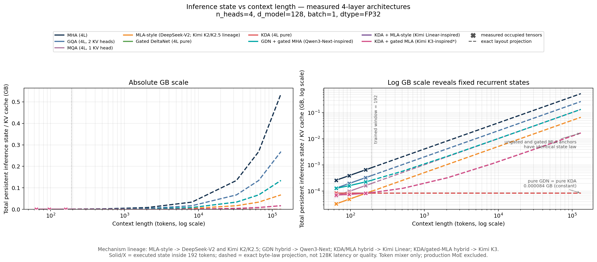

# Efficient Transformer Systems — Skoltech Admission Brief

## Honest project status

This is an engineering research project rather than a completed academic
study. I implemented the key Transformer and recurrent token-mixer components
from scratch to investigate their behavior and engineering trade-offs. Two
controlled experiments are complete and reproducible: a 2-layer
MHA/GQA/MQA/MLA cache study and an 8-variant, 4-layer study of homogeneous and
3:1 hybrid attention systems. Multi-seed, long-context GPU, optimized-kernel,
and multi-GPU studies remain next steps rather than finished results.

MQA follows Shazeer's
[Fast Transformer Decoding](https://arxiv.org/abs/1911.02150): query heads stay
separate while one K head and one V head are shared across all of them. In the
implementation, it is the `H_kv = 1` endpoint of the same grouped-query path.

MLA was introduced by DeepSeek-AI in
[DeepSeek-V2](https://arxiv.org/abs/2405.04434) (first arXiv submission:
7 May 2024). My implementation is intentionally described as **MLA-style**:
it isolates latent K/V cache compression inside a GPT-2 skeleton and is not a
claim of reproducing the complete DeepSeek-V2 inference path.

Gated DeltaNet (GDN) is the recurrent linear-attention mechanism introduced in
[Gated Delta Networks](https://arxiv.org/abs/2412.06464). Kimi Delta Attention
(KDA), introduced in [Kimi Linear](https://arxiv.org/abs/2510.26692), refines
GDN's scalar per-head decay into a channel-wise decay. The full-attention gate
used by the Qwen3-Next-inspired anchor comes from the separate work
[Gated Attention for Large Language Models](https://arxiv.org/abs/2505.06708):
it applies a head-specific sigmoid gate after ordinary softmax SDPA and must not
be cited as the source of GDN.

## The problem

Autoregressive LLM inference stores attention keys and values for every layer,
token, and sequence in a KV cache. As context and batch size grow, this cache
can become a capacity and memory-bandwidth bottleneck. MHA, GQA, MQA, and MLA
change what must be stored, but smaller cache does not guarantee lower latency
on a real execution path. GDN and KDA instead compress history into a fixed
recurrent matrix state. Hybrid systems retain that fixed state in most layers
and use a token-growing full-attention cache only in periodic anchor layers.

**Research question:** Under a fixed nanoGPT/GPT-2 training budget, how do MHA,
GQA, MQA, and MLA-style latent attention trade validation quality for training
and autoregressive inference efficiency?

**Extension question:** Under one 4-layer full-epoch protocol, how do pure GDN
and KDA and the 3:1 schedules `GDN × 3 → gated MHA` and
`KDA × 3 → MLA-style` trade quality, persistent-state memory, and
reference-path latency against homogeneous MHA/GQA/MQA/MLA baselines?

## What I did personally

- Built a shared GPT-2/nanoGPT decoder with interchangeable attention modules.
- Implemented MHA, GQA, MQA, and MLA-style latent K/V compression without
  relying on a prebuilt model implementation.
- Implemented the GDN and KDA recurrent equations, causal depthwise short
  convolutions, L2-normalized Q/K, scalar/channel-wise decay gates, delta
  updates, output gating, and explicit recurrent/conv inference states.
- Implemented Qwen3-Next- and Kimi-Linear-inspired whole-layer 3:1 schedules
  inside the same decoder, while keeping their production-only components out
  of the experimental claim.
- Implemented fixed-capacity KV/latent caches and offset-aware causal masking.
- Added numerical correctness gates: cached token-by-token and chunked outputs
  match full causal computation, including heterogeneous hybrid caches.
- Built deterministic fixed-token training, evaluation, and synchronized
  inference benchmarks with warm-up, raw repetitions, p50, and p95.
- Stored dataset hashes, environments, configurations, curves, and timings in
  machine-readable JSON; Experiment B additionally records its evidence
  boundaries there. Both experiments have generated summaries and executed
  notebooks.

## Method

### Experiment A

All variants use the same character-level Shakespeare split, seed, sequence of
training batches, 256,000-token budget, optimizer, learning rate, decoder
depth/width, evaluation batches, and held-out inference tokens. The experiment
reports parameter count rather than hiding architecture-dependent parameter
changes.

Quality metrics are cross-entropy and perplexity. Perplexity is
`exp(cross-entropy)`; lower is better. Here it is character-level perplexity and
is only compared across models using the same tokenizer and split.

Systems metrics are training tokens/s, prefill latency, cached p50/p95 decode
latency, full-recomputation latency, cache bytes, and caching speedup.

### Experiment B

All eight variants use four layers, width 128, four heads, training context 64,
batch size 16, the same corpus split/hash, seed, shuffled batch order,
optimizer, evaluation tokens, and identical non-attention initialization. The
parameter counts differ and are reported explicitly.

This is a true one-epoch traversal rather than random sampling with
replacement: the training split yields 15,685 complete, non-overlapping
64-token windows. Every window is visited once in **981 batches**, including
the final partial batch, for exactly **1,003,840 training tokens per variant**.
Thirteen trailing tokens that cannot form a complete input/target window are
excluded.

## Experiment A — completed result

At 256,000 training tokens:

| Variant | Val perplexity ↓ | Cached latency ↓ | Cache at 160 tokens ↓ |
|---|---:|---:|---:|
| MHA | **11.81** | **0.205 ms/token** | 320 KiB |
| GQA | 11.89 | 0.224 ms/token | 160 KiB |
| MQA | 11.88 | 0.234 ms/token | 80 KiB |
| MLA | 12.21 | 0.232 ms/token | **40 KiB** |

GQA halves cache memory, MQA reduces it by 4×, and both stay close to MHA
quality in this single run. MLA reduces cache by 8×. None of the compact
variants improves latency in the generic PyTorch path because GQA/MQA expand
shared heads and MLA reconstructs K/V without a fused kernel or weight
absorption. At a 128-token prompt, caching accelerates decoding by 6.48–7.17×
relative to full-prefix recomputation.

### Long-context capacity projection

The measured cache tensors validate the storage formulas at 160 tokens. Holding
the same implemented layouts fixed and extending the byte count to longer
contexts gives the following cache-only capacity result:

| Cached tokens | MHA | GQA | MQA | MLA | MLA advantage over MHA |
|---:|---:|---:|---:|---:|---:|
| 32K | 64 MiB | 32 MiB | 16 MiB | 8 MiB | 8× less cache |
| 128K | 256 MiB | 128 MiB | 64 MiB | 32 MiB | 8× less cache |

Under a separate 1 GiB cache budget, the 128K point corresponds to 4 MHA, 8
GQA, 16 MQA, or 32 MLA-style latent sequence slots. The MQA and MLA advantages
are 4× and 8× respectively; long context makes the absolute memory saving
operationally important. This is an analytical capacity projection for the
prototype data structures, not a measured 128K latency or perplexity result.
The trained model has a 192-token window.

## Experiment B — completed eight-variant result

The two hybrid layouts reproduce the token-mixer schedules, not the complete
production models:

- Qwen3-Next-inspired: `GDN → GDN → GDN → gated MHA`, based on the
  official [Qwen3-Next architecture description](https://qwen.ai/blog?id=e34c4305036ce60d55a0791b170337c2b70ae51d);
- Kimi-Linear-inspired: `KDA → KDA → KDA → MLA-style`, based on the
  [Kimi Linear paper](https://arxiv.org/abs/2510.26692).

The table reports the final validation perplexity after 1,003,840 tokens. The
latency is p50 cached decode from a 128-token prompt, and state is measured
after 32 subsequent decode steps, at 160 total tokens.

| Variant | Parameters | Val PPL ↓ | Train tok/s ↑ | Cached latency ↓ | State @160 ↓ |
|---|---:|---:|---:|---:|---:|
| MHA (4L) | 821,632 | 8.44 | 26,939 | **0.388 ms/token** | 640.0 KiB |
| GQA (4L, 2 KV heads) | 756,096 | 8.48 | 26,310 | 0.426 ms/token | 320.0 KiB |
| MQA (4L, 1 KV head) | 723,328 | 8.84 | **27,057** | 0.415 ms/token | 160.0 KiB |
| MLA-style (4L) | 739,968 | 9.36 | 26,739 | 0.429 ms/token | 80.0 KiB |
| Gated DeltaNet (4L pure) | 897,952 | **5.91** | 2,954 | 3.701 ms/token | 82.0 KiB |
| KDA (4L pure) | 896,400 | 6.15 | 2,857 | 3.696 ms/token | 82.0 KiB |
| GDN + gated MHA (3:1) | 895,256 | 6.11 | 3,772 | 2.723 ms/token | 221.5 KiB |
| KDA + MLA-style (3:1) | 857,292 | 6.24 | 3,723 | 2.763 ms/token | **81.5 KiB** |

Pure GDN obtains the lowest character-level perplexity in this run, and the
four recurrent/hybrid models also finish below the four homogeneous cached
attention baselines. That is an observation from one small epoch and one seed,
not a general claim that GDN or KDA always provides better quality. Pure GDN
and KDA have the same fixed 82 KiB persistent state: KDA's channel-wise decay
changes memory control, not the number of stored state elements. Their complete
blocks also use different output gates (full-rank SiLU for GDN and low-rank
sigmoid for KDA), so this PPL gap is not an isolated scalar-versus-channel
decay ablation.

The first panel is the quality–memory comparison; the other two show why pure
GDN should not be called the globally most efficient system. Its reference
latency and sequential training path are much slower even though it is the
lower-left PPL/state point. Perplexity is next-character predictive quality,
not instruction-answer quality.

### Measured contexts and storage-law projection

The inference benchmark executes prompt/decode pairs `32+32`, `64+32`, and
`128+32`. Thus, only the `X` markers at **64, 96, and 160 total tokens** are
measured cache/state tensors. The model window is 192 tokens. Beyond that
boundary, the figure applies the exact implemented storage law
`fixed_bytes + bytes_per_token × context` through 128K. Dashed lines are not
128K latency, perplexity, retrieval accuracy, or model-memory measurements.

| Variant | Exact state law, bytes | State at 128K |
|---|---:|---:|
| MHA (4L) | `4,096 T` | 512 MiB |
| GQA (4L) | `2,048 T` | 256 MiB |
| MQA (4L) | `1,024 T` | 128 MiB |
| MLA-style (4L) | `512 T` | 64 MiB |
| GDN (4L pure) | `83,968` | 0.080 MiB |
| KDA (4L pure) | `83,968` | 0.080 MiB |
| GDN + gated MHA | `62,976 + 1,024 T` | 128.06 MiB |
| KDA + MLA-style | `62,976 + 128 T` | **16.06 MiB** |

The hybrid state is not constant because every fourth layer still has a
token-growing cache. At 128K, KDA + MLA-style is 3.99× smaller than four
MLA-style layers, approaching the 75% asymptotic reduction expected from
replacing three of four latent-cache layers with recurrent state. Pure GDN/KDA
stay constant in bytes, but their finite matrix state can suffer information
collisions; this graph establishes capacity, not long-context quality.

### Latency interpretation

The recurrent operators use a transparent sequential PyTorch scan. This makes
the equations and cache equivalence inspectable, but it is not the chunkwise
parallel FLA/FlashKDA execution path used in optimized systems. Accordingly,
the measured 2.9–3.8k training tok/s and 2.7–3.7 ms/token cached latency are
reference-kernel results. They must not be used to reject or reproduce the
production speed claims of Qwen3-Next or Kimi Linear. The robust result of this
CPU experiment is the persistent-state storage law; latency remains
kernel- and hardware-dependent.

## What I learned

The project changed the question from “which attention formula is best?” to
“which quality–memory–latency point does the whole implementation realize?” A
compact state representation can improve capacity while losing its theoretical
latency advantage to expansion, reconstruction, Python loops, and kernel
overhead. MQA makes the KV-sharing continuum explicit; MLA reduces per-token
state; GDN/KDA remove token growth inside recurrent layers; and a 3:1 hybrid
retains a smaller growing full-attention component as a content-addressable
path. Memory equations, model quality, and realized kernel speed are three
different questions and must be reported separately.

## Limitations I would state without prompting

- small character-level model and short contexts;
- one dataset, one seed, and models not trained to convergence;
- CPU FP32 timings from one machine;
- Experiment B executes only 64, 96, and 160 total-token inference states;
  points beyond the 192-token window are storage projections, not executions;
- parameter budgets are reported but not matched;
- the common AdamW group applies weight decay to `A_log` and `dt_bias`, unlike
  the no-decay grouping used for those gates in the official recurrent recipes;
- GQA/MQA were appended by deterministic resume in a second local session on
  the same CPU configuration, so small eight-way timing differences are not a
  strict single-session benchmark;
- controlled MLA-style latent K/V uses GPT-2 learned positions and omits
  decoupled RoPE, weight absorption, and fused kernels;
- GDN/KDA use a sequential reference scan rather than optimized chunkwise CUDA
  kernels; dense MLPs replace the production MoE blocks;
- Shakespeare PPL does not test associative recall, state collisions, or
  long-context extrapolation;
- no claim that the observed ranking generalizes to production LLMs.

## Next experiment

The next quality study is **MQAR (Multi-Query Associative Recall)**: train and
evaluate retrieval over increasing sequence lengths, report accuracy and state
collision behavior, and distinguish this task from MQA attention. The next
systems study is a 3–5-seed CUDA BF16 comparison using optimized GDN and KDA
kernels, synchronized prefill/decode p50 and p95, peak allocated GPU memory,
batch-size sweeps, and actually executed long contexts. Matched-parameter
controls, RoPE/NoPE treatment, optimized MLA, and cache quantization follow.
DDP/FSDP/DeepSpeed remains a subsequent scale track after the single-device
correctness baseline.

## Reproducible evidence

- [Experiment A executed notebook](../09_Efficient_Transformer_Systems/01_mha_gqa_mla_comparison.ipynb)
- [Experiment B executed notebook](../09_Efficient_Transformer_Systems/02_gated_deltanet_kda_hybrids.ipynb)
- [Experiment A JSON](../results/attention_systems_cpu.json)
- [Experiment B JSON](../results/hybrid_linear_attention_cpu.json)
- [Experiment B generated summary](../results/HYBRID_EXPERIMENT_SUMMARY.md)
- [Exact state projection CSV](../results/hybrid_state_projection.csv)
- [Measured/projection boundary figure](../results/total_state_vs_context_gb.png)

## 90-second interview version

> I investigated whether modern attention mechanisms actually improve the
> quality–memory–latency trade-off inside the same decoder. I implemented a
> GPT-2-style model with MHA, GQA, MQA, and an MLA-style latent cache, then trained
> every variant on the same data and token budget. Before benchmarking, I
> verified that cached incremental logits match full causal recomputation. GQA
> halved cache memory, MQA reduced it fourfold, and MLA reduced it eightfold.
> The compact variants were not faster because my general PyTorch path expands
> or reconstructs their compact state and has no optimized kernel. That negative latency result was
> useful: it showed that an algorithmic memory improvement becomes a systems
> speedup only when the execution path exploits it. I then extended the study
> to Gated DeltaNet, Kimi Delta Attention, and two 3:1 recurrent/full-attention
> hybrids. I trained eight 4-layer variants for one exact full epoch: 981
> batches and 1,003,840 tokens each. Pure GDN and KDA used a constant 82 KiB
> state; the KDA/MLA hybrid used 81.5 KiB at 160 tokens and has an exact 16.06
> MiB state projection at 128K, versus 512 MiB for MHA. Only 64, 96, and 160
> tokens were executed, so 128K is a storage-law projection, not a latency or
> quality claim. The recurrent timing is also a sequential reference path, not
> an optimized CUDA kernel. My next experiments are MQAR for long-range
> retrieval quality and a multi-seed CUDA BF16 comparison with optimized GDN,
> KDA, and MLA kernels.
