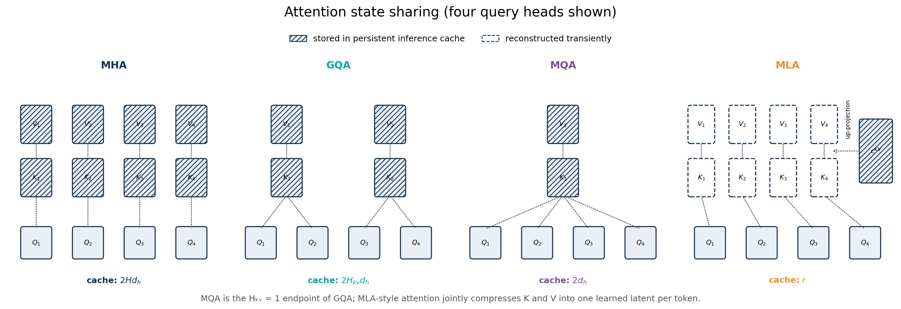
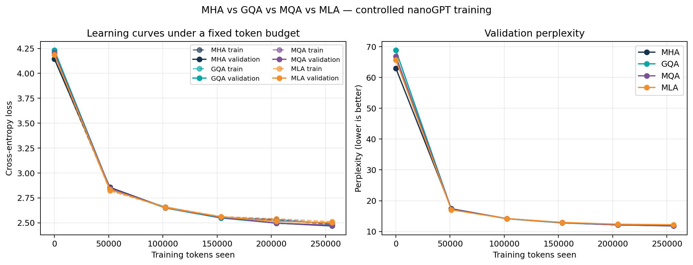
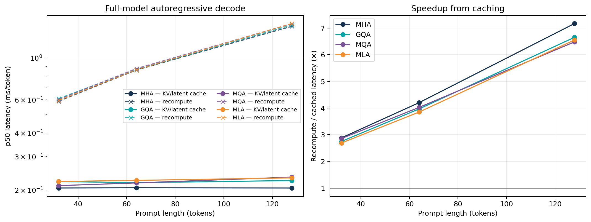
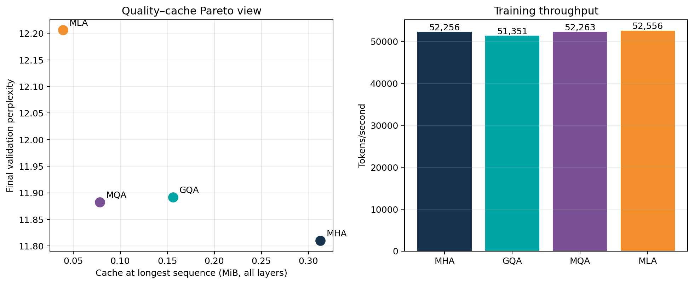
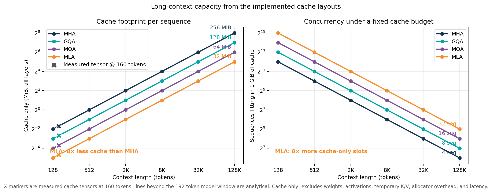

# Efficient Transformer Systems — result summary

Completed controlled run on `cpu` with PyTorch `2.10.0`. All variants saw `256,000` training tokens.

| Variant | Parameters | Final val loss | Val perplexity | Train tokens/s | Cached ms/token | Recompute ms/token | Decode speedup | Cache | vs MHA |
|---|---:|---:|---:|---:|---:|---:|---:|---:|---:|
| MHA | 427,392 | 2.469 | 11.81 | 52,256 | 0.205 | 1.468 | 7.17× | 320.0 KiB | 1.0× smaller |
| GQA | 394,624 | 2.476 | 11.89 | 51,351 | 0.224 | 1.492 | 6.65× | 160.0 KiB | 2.0× smaller |
| MQA | 378,240 | 2.475 | 11.88 | 52,263 | 0.234 | 1.515 | 6.48× | 80.0 KiB | 4.0× smaller |
| MLA | 386,560 | 2.502 | 12.21 | 52,556 | 0.232 | 1.519 | 6.55× | 40.0 KiB | 8.0× smaller |

Inference columns use the longest measured prompt (`128` tokens).

## Long-context cache projection

The following figure is an analytical byte count for the implemented cache layouts, not a timed 128K-context run. It isolates the inference capacity benefit: MLA uses 8× less cache than MHA and therefore fits 8× more sequences under the same cache-only memory budget.

