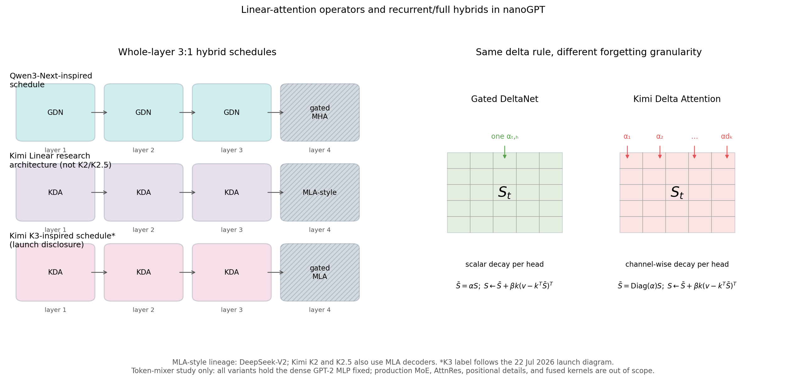
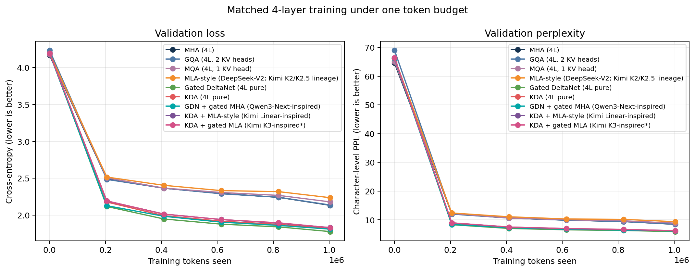
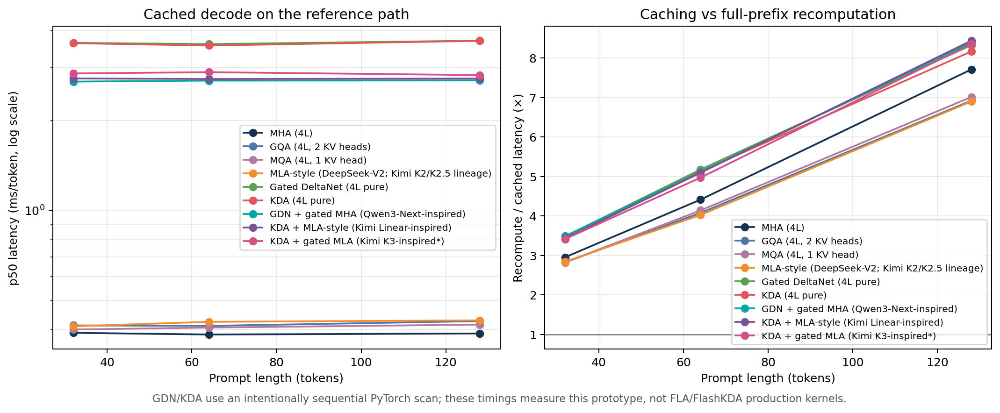
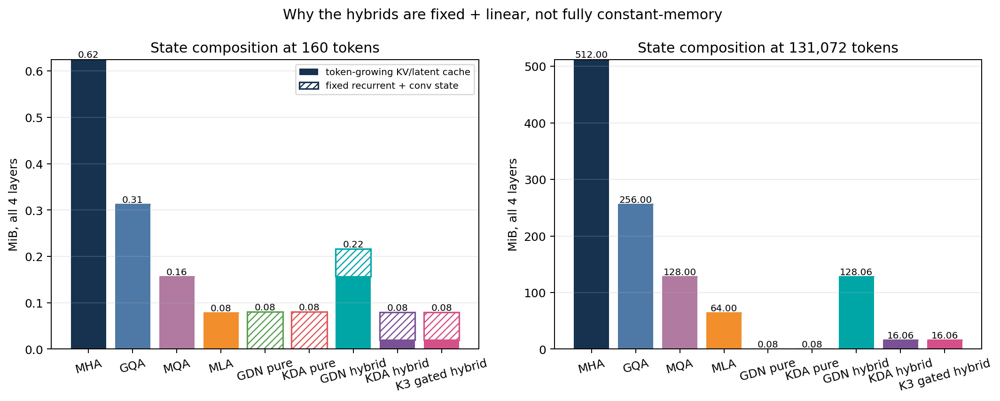

# Recurrent/full attention hybrid experiment — result summary

Completed controlled reference-path run on `cpu`. Every variant used `4` layers and `1,003,840` training tokens.

| Variant | Parameters | Val PPL | Train tok/s | Cached ms/token | Recompute ms/token | State @160 | Fixed state | Growing bytes/token |
|---|---:|---:|---:|---:|---:|---:|---:|---:|
| MHA (4L) | 821,632 | 8.44 | 26,939 | 0.388 | 2.989 | 640.0 KiB | 0.0 KiB | 4,096 |
| GQA (4L, 2 KV heads) | 756,096 | 8.48 | 26,310 | 0.426 | 2.950 | 320.0 KiB | 0.0 KiB | 2,048 |
| MQA (4L, 1 KV head) | 723,328 | 8.84 | 27,057 | 0.415 | 2.911 | 160.0 KiB | 0.0 KiB | 1,024 |
| MLA-style (DeepSeek-V2; Kimi K2/K2.5 lineage) | 739,968 | 9.36 | 26,739 | 0.429 | 2.958 | 80.0 KiB | 0.0 KiB | 512 |
| Gated DeltaNet (4L pure) | 897,952 | 5.91 | 2,954 | 3.701 | 30.815 | 82.0 KiB | 82.0 KiB | 0 |
| KDA (4L pure) | 896,400 | 6.15 | 2,857 | 3.696 | 30.187 | 82.0 KiB | 82.0 KiB | 0 |
| GDN + gated MHA (Qwen3-Next-inspired) | 895,256 | 6.11 | 3,772 | 2.723 | 22.864 | 221.5 KiB | 61.5 KiB | 1,024 |
| KDA + MLA-style (Kimi Linear-inspired) | 857,292 | 6.24 | 3,723 | 2.763 | 23.320 | 81.5 KiB | 61.5 KiB | 128 |
| KDA + gated MLA (Kimi K3-inspired*) | 873,676 | 6.23 | 3,683 | 2.838 | 23.721 | 81.5 KiB | 61.5 KiB | 128 |

The measured state column uses the 128-token prompt plus 32 decoded tokens. GDN and KDA timings are for the sequential PyTorch reference scan, not the production FLA/FlashKDA kernels.

Pure GDN is the lower-left point in the two-metric PPL/state panel (PPL `5.91`, state `82.0 KiB`), but it is not the globally best system: it has more parameters than MHA and its unoptimized training path is `9.1×` slower. PPL measures held-out next-token prediction at the trained window, not instruction-answer quality or long-range recall.

## Long-context state projection

At 128K tokens, the KDA/MLA hybrid uses `16.06 MiB` versus `64.00 MiB` for four MLA-style layers (3.99× smaller, approaching the 75% asymptote). The gated-MLA anchor has the same storage law and reaches `16.06 MiB` (3.99× smaller than four MLA-style layers). These are exact byte counts for the implemented states, not 128K latency or quality measurements.

## Evidence boundary

- One seed, one character-level corpus, 12 deterministic validation batches per checkpoint, and unequal parameter counts.
- GDN and KDA use their respective output gates as well as different decay granularity, so their PPL difference is not an isolated scalar-versus-channel decay ablation.
- One common AdamW parameter group applies weight decay uniformly, including to A_log and dt_bias. The official recurrent-layer recipes exclude those gate parameters from weight decay; this controlled prototype does not reproduce that optimizer grouping.
- GQA and MQA were appended with deterministic resume in a second local session, and the Kimi-K3-inspired variant in a later session, on the same recorded CPU configuration. Quality and storage results remain reproducible, but small timing differences across all nine variants should not be treated as a single-session benchmark.
- Learned GPT-2 positions, dense MLPs, and the 192-token model window do not reproduce the full Qwen3-Next, Kimi Linear, or Kimi K3 systems. The K3-inspired row isolates only the KDA ×3 + sigmoid-gated MLA attention schedule; Stable LatentMoE and Attention Residuals are out of scope.
